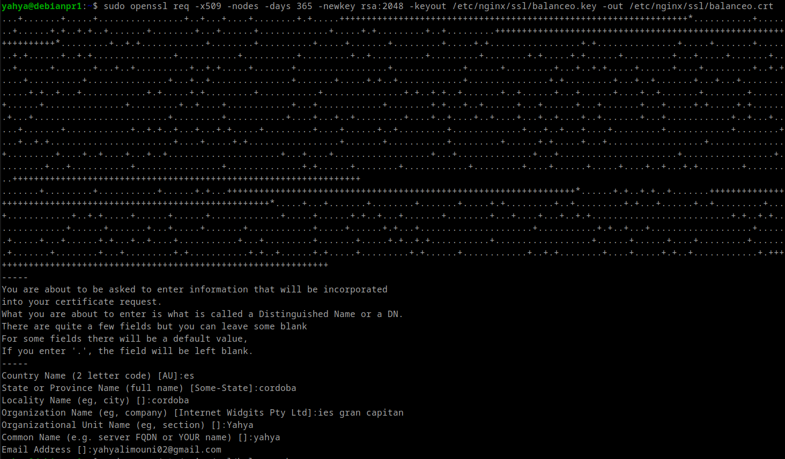
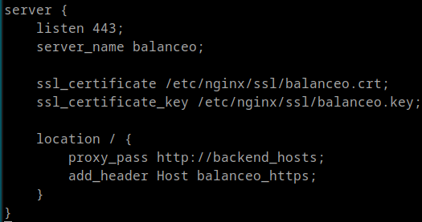
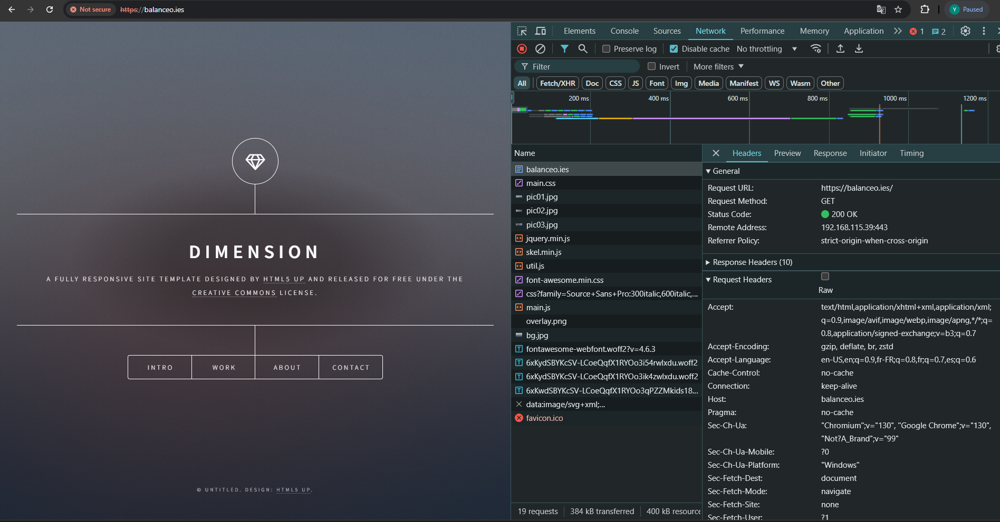
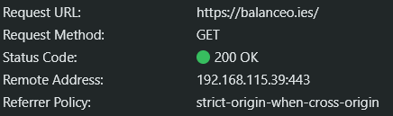

# Practica 2.5

## Introduccion
 En esta practica vamos a configurar SSL en un servidor Proxy. 


## Primero ponemos los bloques de configuracion de SSL en la conf del proxy.

### Ejecutamos el siguiente comando:

        sudo openssl req -x509 -nodes -days 365 -newkey rsa:2048 -keyout /etc/nginx/ssl/balanceo.key -out /etc/nginx/ssl/balanceo.crt 

* ```openssl req```: Inicia la herramienta de solicitud de certificado OpenSSL (req).
* ```-x509```: Genera un certificado **autofirmado** en vez de una solicitud de certificado, porque en nuestro caso solo queremos probar.
* ```-nodes:```: Omite la encriptación de la clave privada, lo que significa que no requerirá una contraseña.
* ```-days 365```: Establece el período de validez del certificado en 365 días (1 año).
* ```-newkey rsa:2048 ```: Crea una nueva clave RSA de 2048 bits junto con el certificado. **RSA** es un algoritmo de enciptacion asimetrica, genera las claves usando 2 numeros primos muy grandes.
* ```-keyout /etc/nginx/ssl/balanceo.key```:  Especifica dónde guardar el archivo de la clave privada.
* ```-out /etc/nginx/ssl/balanceo.crt```: Especifica dónde guardar el archivo del certificado autofirmado.





## Configurar el ```PROXY```:

### Indicamos el ```path``` del certificado y de la clave



## Accedemos a la web con ```https``` :
 - Si nos fijamos en las cabeceras se aprecia ```request URL```: ```https://balanceo.ies```.




